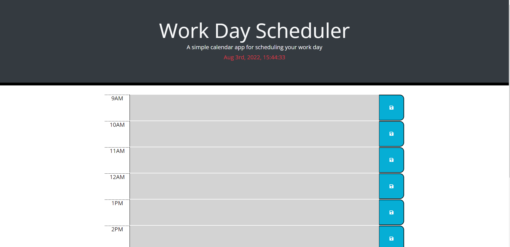

# Work Day Planner

# What is this?
- This is a "work day planner" created using JavaScript/jQuery along side of HTML/CSS with bootstap linked for easy use. Some items also use moment.js which is also linked in the HTML.

- This project was built as part of a requirement for my development certification and a display of my work for future employers.

# Installation
- No installation required, you can use the page in your web browser.

# Usage
- Add whatever you have planned for your day in the according time area and click the save button. If you refresh the page, no worries it is saved to the local storage. 

- The time areas are color coated. "Green" is the current time of the day, "gray" is past times, and "red" is future times. The colors will change automaticly depending on what time of the day it is. The  current time of day is displayed and actively counting on the header of the page.

- You can use and view this app at (https://sspenelope.github.io/Work-Day-Planner/)

# Credits 
- UofM Coding Bootcamp for the starter code containing links for jQuery, bootstrap and moment as well as some of the CSS used in this project.

- Myself for finishing this coded with the requried elements to make it function correctly.

- askBCS for the help when I found myself struggling.

- The awesome instructors at the UofM Coding Bootcamp. You all make coding fun and easy to learn.

# Features
- Within this repository there is a folder in assets labeled "ScriptHardcode". This was the original way I made this code work which can be used to reference if your not sure how something works. What the hardcode does is write everything out line by line so every function 
is shown and variable is shown. Its just really long and ugly which is why im not using it as my main JS file for this project.